# RuoYi-Vue-Plus 架构分析文档

## 1. 项目概述

RuoYi-Vue-Plus 是基于 RuoYi-Vue 重写的企业级后台管理系统脚手架，专门针对分布式集群与多租户场景进行全方位升级。项目采用 Spring Boot 3.4 + JDK 17/21 技术栈，提供了完整的权限管理、多租户、缓存、日志、文件存储等企业级功能。

### 1.1 技术栈

- **后端框架**: Spring Boot 3.4
- **权限认证**: Sa-Token
- **数据库**: MyBatis-Plus + 动态数据源
- **缓存**: Redis + Redisson
- **消息队列**: 支持多种MQ
- **文件存储**: 兼容S3协议的对象存储
- **任务调度**: SnailJob
- **工作流**: Flowable
- **前端**: Vue3 + Element Plus

### 1.2 项目结构

```
ruoyi-vue-plus/
├── ruoyi-admin/           # 主启动模块
├── ruoyi-common/          # 通用模块集合
├── ruoyi-modules/         # 业务模块集合
├── ruoyi-extend/          # 扩展模块集合
└── script/               # 脚本文件
```

## 2. 架构设计理念

### 2.1 模块化设计

项目采用高度模块化的设计，每个功能都封装为独立的模块，支持按需引入：

- **插件化**: 通过 SPI 机制实现模块的自动装配
- **解耦合**: 模块间通过接口和事件进行通信
- **可扩展**: 支持自定义模块的快速集成

### 2.2 分层架构

```
Controller层 -> Service层 -> Mapper层 -> Database
     ↓
  Common模块提供横切关注点支持
```

## 3. Common模块详细分析

+ **各个模板写作关系图**

```mermaid
graph TB
    subgraph "核心基础层"
        Core[ruoyi_common_core核心工具类,常量,异常]
        Json[ruoyi_common_jsonJSON处理]
    end
    
    subgraph "Web层"
        Web[ruoyi_common_webWeb功能,异常处理]
        SaToken[ruoyi_common_satoken权限认证]
        Security[ruoyi_common_security安全模块]
    end
    
    subgraph "数据层"
        MyBatis[ruoyi_common_mybatis数据库操作]
        Redis[ruoyi_common_redis缓存]
        Tenant[ruoyi_common_tenant多租户]
    end
    
    subgraph "功能增强层"
        Log[ruoyi_common_log日志记录]
        Excel[ruoyi_common_excelExcel处理]
        OSS[ruoyi_common_oss对象存储]
        Translation[ruoyi_common_translation翻译]
        Sensitive[ruoyi_common_sensitive脱敏]
    end
    
    subgraph "扩展功能层"
        Encrypt[ruoyi_common_encrypt加密]
        SMS[ruoyi_common_sms短信]
        Mail[ruoyi_common_mail邮件]
        RateLimit[ruoyi_common_ratelimiter限流]
        Idempotent[ruoyi_common_idempotent幂等]
        Job[ruoyi_common_job任务调度]
        Doc[ruoyi_common_doc文档]
        Social[ruoyi_common_social社交登录]
    end
    
    %% 依赖关系
    Web --> Core
    SaToken --> Core
    Security --> SaToken
    
    MyBatis --> Core
    MyBatis --> SaToken
    Redis --> Core
    Tenant --> MyBatis
    Tenant --> Redis
    
    Log --> SaToken
    Log --> Json
    Excel --> Core
    OSS --> Core
    OSS --> Redis
    Translation --> Core
    Sensitive --> Json
    
    Encrypt --> Core
    SMS --> Core
    Mail --> Core
    RateLimit --> Redis
    Idempotent --> Redis
    Idempotent --> Json
    Job --> Json
    
    %% 协作关系
    MyBatis -.-> Tenant
    Redis -.-> Tenant
    SaToken -.-> Redis
    Log -.-> MyBatis
    Translation -.-> MyBatis
    Sensitive -.-> SaToken
    
    classDef coreLayer fill:#e1f5fe
    classDef webLayer fill:#f3e5f5
    classDef dataLayer fill:#e8f5e8
    classDef enhanceLayer fill:#fff3e0
    classDef extendLayer fill:#fce4ec
    
    class Core,Json coreLayer
    class Web,SaToken,Security webLayer
    class MyBatis,Redis,Tenant dataLayer
    class Log,Excel,OSS,Translation,Sensitive enhanceLayer
    class Encrypt,SMS,Mail,RateLimit,Idempotent,Job,Doc,Social extendLayer
```


### 3.1 ruoyi-common-core (核心模块)

**功能**: 提供系统的基础工具类、常量定义、异常处理等核心功能

**核心组件**:

- **工具类**: StringUtils、DateUtils、JsonUtils、SpringUtils等
- **实体基类**: BaseEntity、TreeEntity提供通用字段
- **异常处理**: ServiceException、GlobalExceptionHandler
- **常量定义**: 系统级常量、缓存名称等
- **验证分组**: AddGroup、EditGroup用于参数校验

**对接实现**:

- 通过 `@AutoConfiguration` 自动装配
- 提供 `SpringUtils` 获取Spring上下文
- 统一异常处理机制

### 3.2 ruoyi-common-web (Web模块)

**功能**: 处理Web层的通用功能，包括全局异常处理、响应封装等

**核心组件**:

- **全局异常处理器**: `GlobalExceptionHandler` 统一处理系统异常
- **响应封装**: `R<T>` 统一响应格式
- **过滤器**: 请求包装、响应包装
- **拦截器**: 请求日志、性能监控

**对接实现**:

- 通过 `@ControllerAdvice` 实现全局异常拦截
- 自动装配Web相关配置
- 提供统一的响应格式

### 3.3 ruoyi-common-satoken (权限认证模块)

**功能**: 基于Sa-Token实现的权限认证体系

**核心组件**:

- **Sa-Token配置**: `SaTokenConfig` 配置认证参数
- **权限校验**: `@SaCheckPermission`、`@SaCheckRole` 注解
- **登录用户**: `LoginUser` 用户信息模型
- **权限助手**: `LoginHelper` 提供权限操作工具

**对接实现**:

- 集成Sa-Token框架
- 自定义权限验证逻辑
- 支持多端登录管理
- 提供权限注解支持

**权限认证调用时序图**

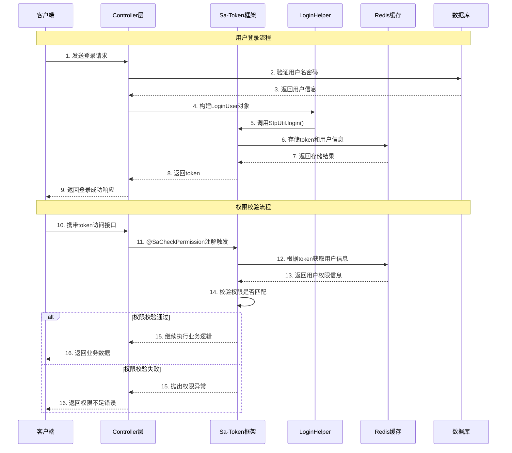

**数据权限模块执行流程图**

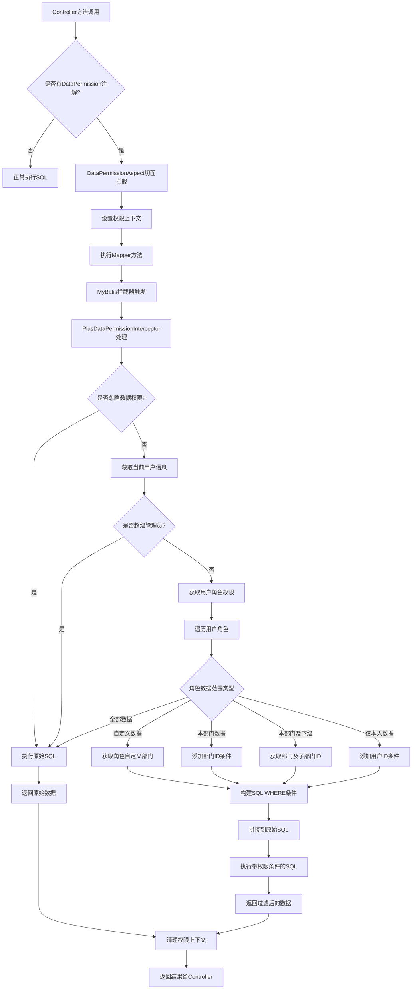


### 3.4 ruoyi-common-redis (缓存模块)

**功能**: Redis缓存和Redisson分布式锁的集成

**核心组件**:

- **Redisson配置**: 支持单机、集群、哨兵模式
- **缓存工具**: `RedisUtils` 提供缓存操作
- **分布式锁**: `@Lock4j` 注解实现分布式锁
- **缓存管理**: `PlusSpringCacheManager` 缓存管理器

**对接实现**:

- 自动配置Redisson客户端
- 集成Spring Cache抽象
- 提供分布式锁注解支持
- 支持缓存监听和管理

**redis缓存模板调用时序图**

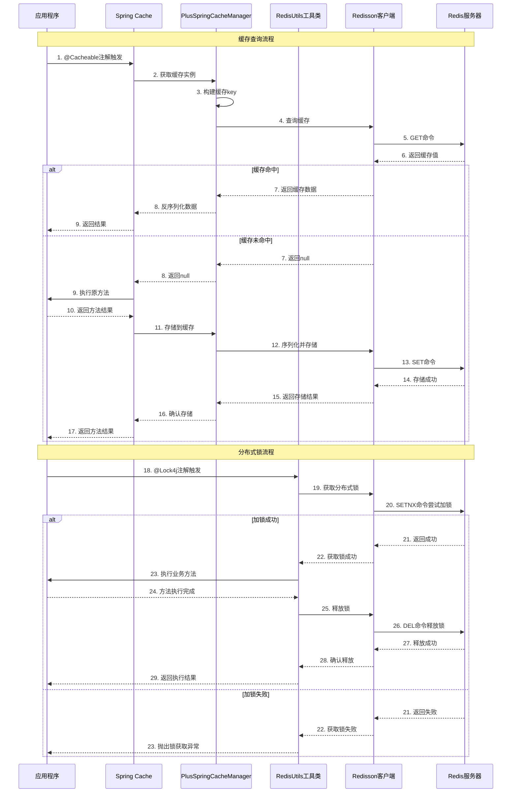


### 3.5 ruoyi-common-mybatis (数据库模块)

**功能**: MyBatis-Plus集成，提供数据权限、多租户、分页等功能

**核心组件**:

- **MyBatis-Plus配置**: `MybatisPlusConfig` 配置插件
- **数据权限**: `@DataPermission` 注解实现行级数据权限
- **分页插件**: `PaginationInnerInterceptor` 自动分页
- **审计字段**: `InjectionMetaObjectHandler` 自动填充创建/更新信息
- **乐观锁**: `OptimisticLockerInnerInterceptor` 乐观锁支持

**对接实现**:

- 配置MyBatis-Plus拦截器链
- 实现数据权限SQL拦截
- 支持多数据源动态切换
- 提供分页查询封装

### 3.6 ruoyi-common-tenant (多租户模块)

**功能**: 实现SaaS多租户数据隔离

**核心组件**:

- **租户拦截器**: `TenantLineInnerInterceptor` SQL自动添加租户条件
- **租户处理器**: `PlusTenantLineHandler` 租户ID处理
- **租户助手**: `TenantHelper` 租户操作工具
- **缓存隔离**: `TenantSpringCacheManager` 租户级缓存

**对接实现**:

- 自动在SQL中添加租户条件
- Redis缓存key添加租户前缀
- 支持动态租户切换
- 提供租户忽略机制

**多租户模块执行流程图**

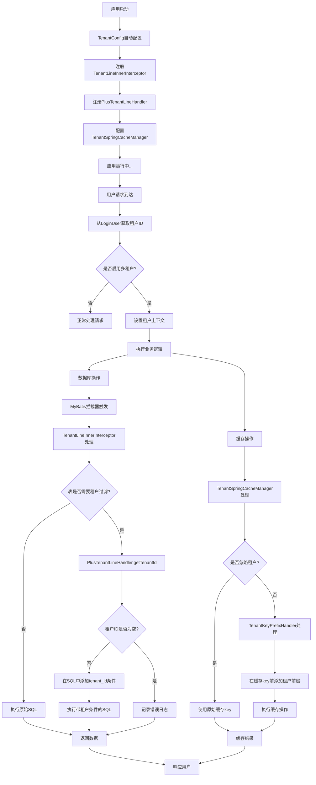


### 3.7 ruoyi-common-oss (对象存储模块)

**功能**: 兼容S3协议的对象存储服务

**核心组件**:

- **OSS客户端**: `OssClient` 统一存储操作接口
- **存储工厂**: `OssFactory` 多存储服务管理
- **上传结果**: `UploadResult` 上传结果封装
- **配置管理**: 支持MinIO、阿里云OSS、腾讯云COS等

**对接实现**:

- 基于AWS S3 SDK实现
- 支持多种云存储服务
- 提供统一的文件操作接口
- 支持预签名URL生成

**对象存储模板调用时序图**

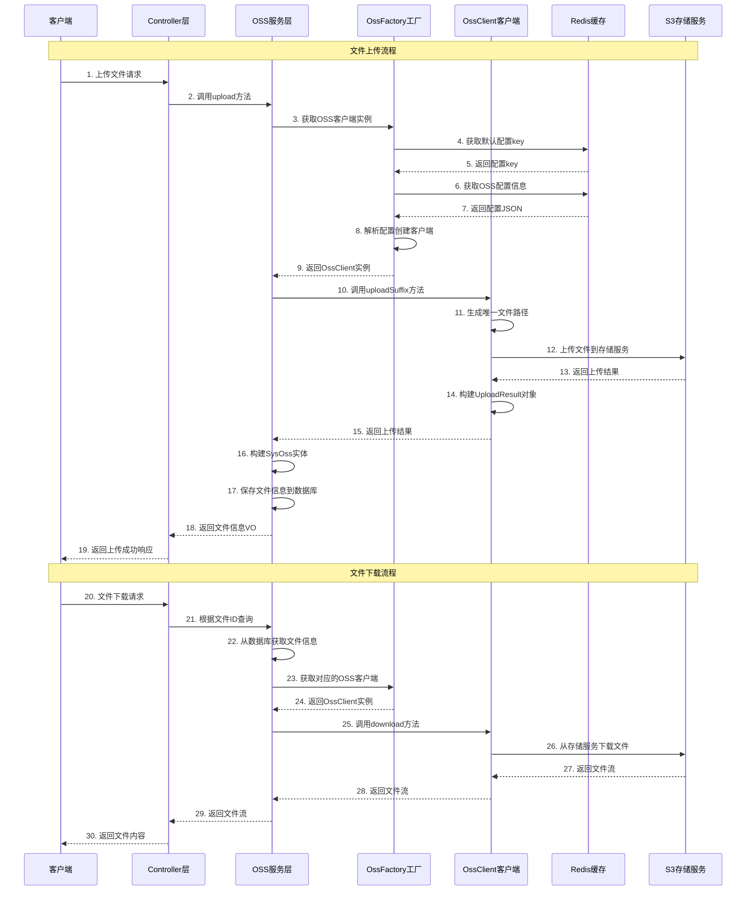


### 3.8 ruoyi-common-excel (Excel处理模块)

**功能**: 基于EasyExcel的Excel导入导出功能

**核心组件**:

- **Excel工具**: `ExcelUtil` 提供导入导出方法
- **监听器**: `DefaultExcelListener` 处理导入数据
- **转换器**: `ExcelDictConvert`、`ExcelEnumConvert` 数据转换
- **下拉选择**: `ExcelDownHandler` 生成下拉选项

**对接实现**:

- 集成EasyExcel框架
- 支持数据校验和转换
- 提供模板导出功能
- 支持大数据量处理

**Excel处理模板执行流程图**

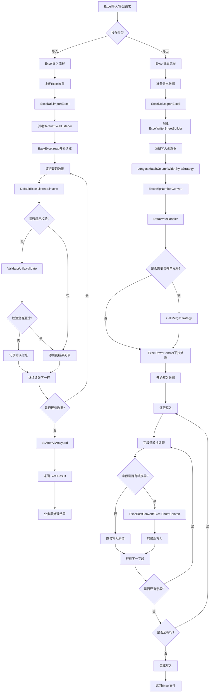


### 3.9 ruoyi-common-log (日志模块)

**功能**: 操作日志和登录日志的自动记录

**核心组件**:

- **日志注解**: `@Log` 标记需要记录的操作
- **日志切面**: `LogAspect` 自动记录操作日志
- **日志事件**: `OperLogEvent`、`LogininforEvent` 异步处理
- **日志服务**: 异步保存日志到数据库

**对接实现**:

- 基于AOP实现日志拦截
- 使用Spring事件机制异步处理
- 自动记录操作参数和结果
- 支持敏感信息过滤


**日志模板调用时序图**

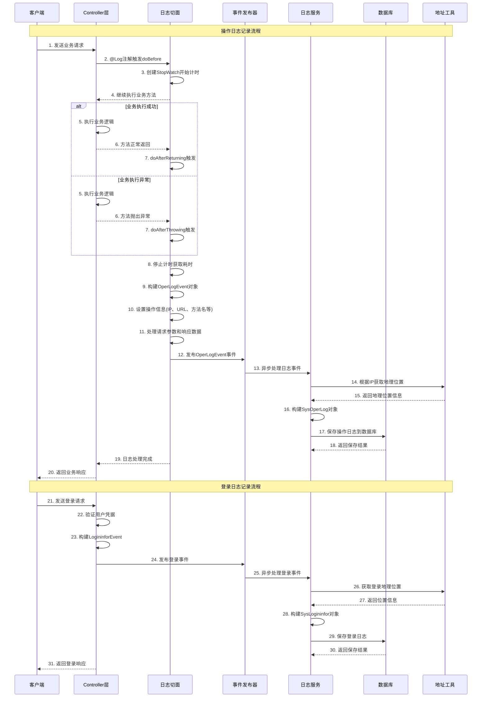


### 3.10 其他Common模块

#### ruoyi-common-encrypt (加密模块)

- 支持AES、RSA、SM2、SM4等加密算法
- 提供API请求/响应加密
- 支持数据库字段加密

#### ruoyi-common-sms (短信模块)

- 集成SMS4J短信框架
- 支持多种短信服务商
- 提供统一的短信发送接口

#### ruoyi-common-mail (邮件模块)

- 基于Hutool邮件工具
- 支持HTML邮件和附件
- 提供邮件模板功能

#### ruoyi-common-ratelimiter (限流模块)

- 基于Redis实现分布式限流
- 支持IP限流、用户限流等
- 提供 `@RateLimiter` 注解

**限流模板执行流程图**

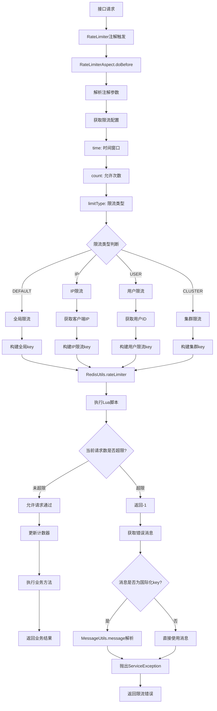


#### ruoyi-common-idempotent (幂等模块)

- 防止重复提交
- 基于Redis实现
- 提供 `@RepeatSubmit` 注解

**幂等模板执行流程图**

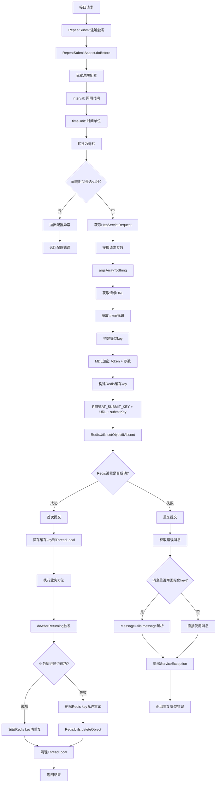


```mermaid

```


#### ruoyi-common-sensitive (脱敏模块)

- 数据脱敏处理
- 支持多种脱敏策略
- 基于角色和权限控制

**脱敏模块执行流程图**

```mermaid
flowchart TD
    A[对象序列化] --> B[Jackson序列化器扫描]
    B --> C{字段是否有Sensitive注解?}
    C -->|否| D[正常序列化]
    C -->|是| E[SensitiveHandler处理]
    
    E --> F[获取注解配置]
    F --> G[strategy脱敏策略]
    G --> H[roleKey角色标识]
    H --> I[perms权限标识]
    
    I --> J[SpringUtils.getBean_SensitiveService]
    J --> K{SensitiveService是否存在?}
    K -->|否| L[记录错误日志]
    K -->|是| M[调用isSensitive方法]
    
    M --> N[获取当前登录用户]
    N --> O{用户是否为超级管理员?}
    O -->|是| P[不脱敏]
    O -->|否| Q{用户是否为租户管理员?}
    Q -->|是| P
    Q -->|否| R[检查角色权限条件]
    
    R --> S{是否配置了roleKey?}
    S -->|是| T[检查用户角色]
    S -->|否| U{是否配置了perms?}
    
    T --> V{用户是否拥有指定角色?}
    V -->|是| W[角色条件满足]
    V -->|否| X[角色条件不满足]
    
    U -->|是| Y[检查用户权限]
    U -->|否| Z[无条件限制,需要脱敏]
    
    Y --> AA{用户是否拥有指定权限?}
    AA -->|是| BB[权限条件满足]
    AA -->|否| CC[权限条件不满足]
    
    W --> DD{是否同时配置角色和权限?}
    BB --> DD
    X --> EE{是否同时配置角色和权限?}
    CC --> EE
    
    DD -->|是| FF{角色和权限是否都满足?}
    DD -->|否| P
    EE -->|是| GG[需要脱敏]
    EE -->|否| GG
    
    FF -->|是| P
    FF -->|否| GG
    
    P --> HH[输出原始值]
    Z --> GG
    GG --> II[根据strategy执行脱敏]
    
    II --> JJ{脱敏策略类型}
    JJ -->|ID_CARD| KK[身份证脱敏]
    JJ -->|PHONE| LL[手机号脱敏]
    JJ -->|EMAIL| MM[邮箱脱敏]
    JJ -->|ADDRESS| NN[地址脱敏]
    JJ -->|其他| OO[对应策略脱敏]
    
    KK --> PP[DesensitizedUtil.idCardNum]
    LL --> QQ[DesensitizedUtil.mobilePhone]
    MM --> RR[DesensitizedUtil.email]
    NN --> SS[DesensitizedUtil.address]
    OO --> TT[对应脱敏方法]
    
    PP --> UU[输出脱敏后的值]
    QQ --> UU
    RR --> UU
    SS --> UU
    TT --> UU
    
    L --> HH
    D --> VV[输出字段值]
    HH --> VV
    UU --> VV
```


#### ruoyi-common-translation (翻译模块)

- 字段值翻译功能
- 支持字典、用户名等翻译
- 提供 `@Translation` 注解

**翻译模块执行流程图**

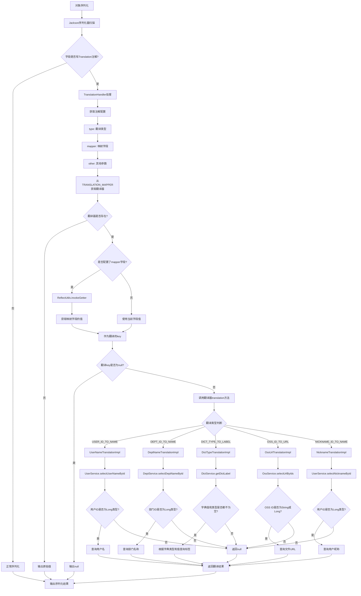


## 4. 业务模块分析

### 4.1 ruoyi-modules 业务模块集合

#### ruoyi-system (系统管理模块)

- **用户管理**: 用户CRUD、角色分配、数据权限
- **角色管理**: 角色权限分配、数据范围设置
- **菜单管理**: 菜单树形结构、权限控制
- **部门管理**: 组织架构管理
- **字典管理**: 系统字典维护
- **参数管理**: 系统参数配置
- **通知公告**: 系统通知功能
- **日志管理**: 操作日志、登录日志查询
- **在线用户**: 在线用户管理
- **租户管理**: 多租户管理(可选)

#### ruoyi-generator (代码生成器)

- **表结构导入**: 从数据库导入表结构
- **代码生成**: 生成Controller、Service、Mapper、Entity等
- **模板定制**: 支持自定义代码模板
- **预览功能**: 生成前预览代码

#### ruoyi-job (任务调度模块)

- 集成SnailJob分布式任务调度
- 支持Cron表达式
- 任务执行监控
- 失败重试机制

#### ruoyi-workflow (工作流模块)

- 集成Flowable工作流引擎
- 流程设计器
- 任务处理
- 流程监控

#### ruoyi-demo (演示模块)

- 功能演示案例
- 最佳实践示例
- 测试用例

### 4.2 ruoyi-extend 扩展模块集合

#### ruoyi-monitor-admin (监控模块)

- Spring Boot Admin监控
- 应用健康检查
- 性能指标监控

#### ruoyi-snailjob-server (任务调度服务)

- SnailJob调度服务器
- 任务管理界面
- 执行日志查看

## 5. 核心功能实现机制

### 5.1 权限认证机制

```java
// Sa-Token权限校验示例
@SaCheckPermission("system:user:list")
@SaCheckRole("admin")
public R<List<SysUserVo>> list() {
    // 业务逻辑
}
```

**实现原理**:

- 基于Sa-Token框架的注解式权限控制
- 支持细粒度的权限和角色校验
- 集成多端登录管理
- 提供权限缓存机制

### 5.2 数据权限机制

```java
// 数据权限注解示例
@DataPermission({
    @DataColumn(key = "deptName", value = "dept_id"),
    @DataColumn(key = "userName", value = "user_id")
})
public List<SysUserVo> selectUserList() {
    // 自动添加数据权限SQL条件
}
```

**实现原理**:

- 通过MyBatis拦截器自动在SQL中添加权限条件
- 支持部门数据权限、个人数据权限等
- 基于用户角色动态生成权限SQL
- 支持自定义数据权限规则

### 5.3 多租户实现机制

```java
// 租户自动隔离
@TableName("sys_user")
public class SysUser extends TenantEntity {
    // 自动添加tenant_id字段过滤
}
```

**实现原理**:

- SQL自动添加租户条件过滤
- Redis缓存key自动添加租户前缀
- 支持租户动态切换
- 提供租户忽略机制

### 5.4 缓存机制

```java
// 缓存注解使用
@Cacheable(cacheNames = CacheNames.SYS_USER, key = "#userId")
public SysUserVo selectUserById(Long userId) {
    // 自动缓存用户信息
}
```

**实现原理**:

- 基于Spring Cache + Redis实现
- 支持多级缓存策略
- 提供缓存预热和失效机制
- 集成分布式锁防止缓存击穿

### 5.5 异步事件机制

```java
// 异步事件发布
@EventListener
@Async
public void recordOper(OperLogEvent operLogEvent) {
    // 异步处理操作日志
}
```

**实现原理**:

- 基于Spring事件机制
- 支持异步事件处理
- 提供事件监听器自动注册
- 支持事务事件处理

## 6. 配置和扩展指南

### 6.1 模块依赖配置

```xml
<!-- 在业务模块中引入通用模块 -->
<dependency>
    <groupId>org.dromara</groupId>
    <artifactId>ruoyi-common-core</artifactId>
</dependency>
<dependency>
    <groupId>org.dromara</groupId>
    <artifactId>ruoyi-common-web</artifactId>
</dependency>
```

### 6.2 自定义模块开发

1. **创建模块**: 在ruoyi-common下创建新模块
2. **添加依赖**: 在common-bom中声明版本
3. **自动装配**: 创建META-INF/spring/org.springframework.boot.autoconfigure.AutoConfiguration.imports
4. **使用模块**: 在业务模块中引入依赖

### 6.3 配置文件说明

```yaml
# 主要配置项
mybatis-plus:
  mapperPackage: org.dromara.**.mapper
  enableLogicDelete: true

tenant:
  enable: true
  excludes:
    - gen_table
    - gen_table_column

sa-token:
  token-name: Authorization
  timeout: 2592000
```

## 7. 最佳实践建议

### 7.1 开发规范

- 统一使用MapStruct进行对象转换
- 业务对象使用Bo(Business Object)后缀
- 视图对象使用Vo(View Object)后缀
- 数据库实体使用Entity或直接使用表名

### 7.2 性能优化

- 合理使用缓存，避免缓存穿透
- 数据库查询使用分页，避免全表扫描
- 异步处理耗时操作，如日志记录
- 使用连接池管理数据库连接

### 7.3 安全建议

- 敏感数据使用脱敏处理
- API接口使用加密传输
- 定期更新依赖版本，修复安全漏洞
- 实施最小权限原则

## 8. 总结

RuoYi-Vue-Plus通过高度模块化的设计，将企业级应用的各种功能封装为独立的模块，每个模块都有明确的职责和边界。通过Spring Boot的自动装配机制，实现了模块的即插即用。这种设计使得系统具有良好的可维护性、可扩展性和可测试性，是企业级应用开发的优秀实践。

主要特点：

1. **模块化**: 功能模块独立，支持按需引入
2. **标准化**: 统一的编码规范和架构模式
3. **企业级**: 完整的权限、多租户、缓存、日志等功能
4. **可扩展**: 支持自定义模块和功能扩展
5. **高性能**: 基于Redis、MyBatis-Plus等高性能组件
6. **易维护**: 清晰的分层架构和代码结构

该脚手架为企业级应用开发提供了完整的解决方案，大大降低了开发成本和维护难度，是Java企业级应用开发的优秀选择。

## 9. Common模块调用时序图和流程图

### 9.1 权限认证模块 (ruoyi-common-satoken) 调用时序图

**功能说明**: 展示用户登录和权限校验的完整流程，包括token生成、存储和验证机制。

**关键流程**:

1. **登录流程**: 用户凭据验证 → 构建LoginUser → 生成token → Redis存储
2. **权限校验**: 请求拦截 → token验证 → 权限匹配 → 放行或拒绝

### 9.2 数据权限模块 (ruoyi-common-mybatis) 执行流程图

**功能说明**: 展示数据权限如何通过AOP切面和MyBatis拦截器实现行级数据过滤。

**关键流程**:

1. **切面拦截**: @DataPermission注解触发 → 设置权限上下文
2. **SQL拦截**: MyBatis拦截器 → 权限条件构建 → SQL改写
3. **权限判断**: 用户角色 → 数据范围 → 条件生成

### 9.3 多租户模块 (ruoyi-common-tenant) 执行流程图

**功能说明**: 展示多租户数据隔离的实现机制，包括数据库和缓存的租户隔离。

**关键流程**:

1. **数据库隔离**: SQL自动添加tenant_id条件
2. **缓存隔离**: 缓存key自动添加租户前缀
3. **租户上下文**: 从登录用户获取租户信息

### 9.4 Redis缓存模块 (ruoyi-common-redis) 调用时序图

**功能说明**: 展示Spring Cache集成Redis的缓存机制和分布式锁的实现。

**关键流程**:

1. **缓存查询**: 注解触发 → 缓存查找 → 命中返回/未命中执行方法
2. **分布式锁**: 锁获取 → 业务执行 → 锁释放

### 9.5 对象存储模块 (ruoyi-common-oss) 调用时序图

**功能说明**: 展示文件上传下载的完整流程，包括配置获取、客户端创建和存储操作。

**关键流程**:

1. **文件上传**: 配置获取 → 客户端创建 → 文件上传 → 信息保存
2. **文件下载**: 信息查询 → 客户端获取 → 文件下载 → 流返回

### 9.6 Excel处理模块 (ruoyi-common-excel) 执行流程图

**功能说明**: 展示Excel导入导出的处理流程，包括数据校验、转换和写入机制。

**关键流程**:

1. **Excel导入**: 文件读取 → 数据校验 → 结果收集
2. **Excel导出**: 数据准备 → 处理器注册 → 数据写入

### 9.7 日志模块 (ruoyi-common-log) 调用时序图

**功能说明**: 展示操作日志和登录日志的自动记录机制，基于AOP和事件驱动。

**关键流程**:

1. **操作日志**: AOP拦截 → 日志构建 → 异步事件 → 数据库保存
2. **登录日志**: 登录事件 → 异步处理 → 地址解析 → 日志保存

### 9.8 限流模块 (ruoyi-common-ratelimiter) 执行流程图

**功能说明**: 展示基于Redis的分布式限流实现，支持多种限流策略。

**关键流程**:

1. **限流检查**: 注解解析 → key构建 → Redis计数 → 通过/拒绝
2. **限流类型**: 全局/IP/用户/集群限流

### 9.9 幂等模块 (ruoyi-common-idempotent) 执行流程图

**功能说明**: 展示防重复提交的实现机制，基于Redis的分布式幂等控制。

**关键流程**:

1. **重复检查**: 参数提取 → key生成 → Redis检查 → 首次/重复判断
2. **状态管理**: 成功保留key/失败删除key

### 9.10 数据脱敏模块 (ruoyi-common-sensitive) 执行流程图

**功能说明**: 展示数据脱敏的实现机制，基于Jackson序列化器的字段级脱敏。

**关键流程**:

1. **权限判断**: 用户角色/权限检查 → 脱敏决策
2. **脱敏处理**: 策略选择 → 脱敏执行 → 结果输出

### 9.11 翻译模块 (ruoyi-common-translation) 执行流程图

**功能说明**: 展示字段值翻译的实现机制，支持多种翻译类型的自动转换。

**关键流程**:

1. **翻译触发**: 注解检测 → 翻译器获取 → 值转换
2. **翻译类型**: 用户名/部门名/字典/OSS等翻译

## 10. 模块间协作关系图

**功能说明**: 展示各个common模块之间的依赖关系和协作模式，帮助理解模块的分层架构。

**分层说明**:

1. **核心基础层**: 提供最基础的工具类和常量定义，被所有其他模块依赖
2. **Web层**: 处理Web相关功能，包括权限认证和安全控制
3. **数据层**: 处理数据存储和缓存，支持多租户架构
4. **功能增强层**: 提供业务功能增强，如日志、Excel、文件存储等
5. **扩展功能层**: 提供可选的扩展功能，如加密、短信、邮件等

**关键协作关系**:

- **多租户模块**: 与MyBatis和Redis深度集成，实现数据和缓存的租户隔离
- **权限认证**: 与Redis集成实现token存储，与数据权限模块协作实现细粒度控制
- **日志模块**: 与权限模块协作获取用户信息，与数据库模块协作存储日志
- **脱敏模块**: 与权限模块协作判断用户权限，决定是否脱敏
- **翻译模块**: 与数据库模块协作查询翻译数据

## 11. 使用建议和最佳实践

### 11.1 模块选择建议

**必选模块**:

- `ruoyi-common-core`: 核心基础功能
- `ruoyi-common-web`: Web应用必需
- `ruoyi-common-satoken`: 权限认证
- `ruoyi-common-mybatis`: 数据库操作
- `ruoyi-common-redis`: 缓存支持

**推荐模块**:

- `ruoyi-common-log`: 操作审计
- `ruoyi-common-excel`: 数据导入导出
- `ruoyi-common-oss`: 文件存储
- `ruoyi-common-tenant`: 多租户支持(SaaS应用)

**可选模块**:

- `ruoyi-common-ratelimiter`: API限流
- `ruoyi-common-idempotent`: 防重复提交
- `ruoyi-common-sensitive`: 数据脱敏
- `ruoyi-common-translation`: 字段翻译
- `ruoyi-common-encrypt`: 数据加密

### 11.2 性能优化建议

1. **缓存策略**:
   
   - 合理设置缓存过期时间
   - 使用缓存预热避免冷启动
   - 实施缓存降级策略

2. **数据库优化**:
   
   - 合理使用数据权限，避免过度复杂的权限SQL
   - 多租户场景下注意索引设计
   - 使用分页查询避免大数据量查询

3. **异步处理**:
   
   - 日志记录使用异步事件
   - 文件上传使用异步处理
   - 邮件发送使用异步队列

### 11.3 安全建议

1. **权限控制**:
   
   - 实施最小权限原则
   - 定期审计用户权限
   - 使用数据权限控制敏感数据访问

2. **数据保护**:
   
   - 敏感数据使用脱敏处理
   - 重要数据使用加密存储
   - 实施数据备份和恢复策略

3. **接口安全**:
   
   - 使用限流防止恶意攻击
   - 实施幂等控制防止重复操作
   - 对外接口使用加密传输

## 12. 总结

RuoYi-Vue-Plus的common模块体系通过精心设计的分层架构和模块化组织，为企业级应用开发提供了完整的基础设施支持。每个模块都有明确的职责边界，通过标准化的接口和配置实现了高度的可复用性和可扩展性。

**核心优势**:

1. **模块化设计**: 功能独立，按需引入，降低系统复杂度
2. **标准化实现**: 统一的编程模式和配置方式，降低学习成本
3. **企业级特性**: 完整的权限、多租户、缓存、日志等企业功能
4. **高度集成**: 各模块间协作紧密，提供一致的开发体验
5. **性能优化**: 基于成熟的开源组件，经过生产环境验证

通过本文档的详细分析和流程图说明，开发者可以快速理解各个模块的工作原理和使用方式，为基于RuoYi-Vue-Plus的项目开发提供有力支持。
