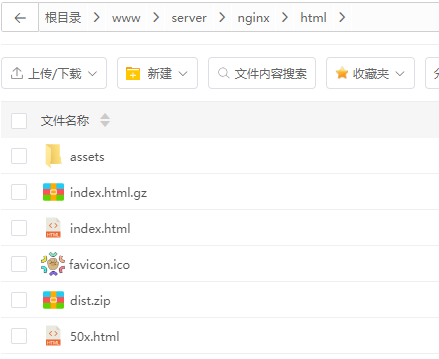

[TOC]


# ES_OMS


## 基础架构
+ todo
## 数据库
+ es迁移
+ 添加tenant_id、create_dept
```sql
alter table public.es_tms_client
    add tenant_id varchar(20);

comment on column public.es_tms_client.tenant_id is '租户id';

alter table public.es_tms_client
    add create_dept bigint;

comment on column public.es_tms_client.create_dept is '创建部门';


```
+ 修改create_by, create_time

```sql
alter table public.es_tms_order_base_change_log
    rename column insert_user_id to create_by;

alter table public.es_tms_order_base_change_log
    rename column update_user_id to update_by;

alter table public.es_tms_order_base_change_log
    rename column insert_timestamp to create_time;


alter table public.es_tms_order_base_change_log
    rename column update_timestamp to update_time;

```
## 部署

+ 前端打包，上传服务器后解压缩到nginx配置文件指定的目录下（不指定默认是nginx的html目录下）
+ npm run build:prod



+ 配置nginx.conf文件信息
+ 后端打jar包，后上传服务器(当前放在`~/project`下)
+ 执行`nohup java -jar ruoyi-admin.jar &`

+ 后端端口和认证端口合一为8080（可以手动修如8088，前端则必须跟着调整），cloud同理
+ 前段项目启动有单独端口（生产默认80），通过vite代理将80端口的请求转发到后端端口（如8080）；
+ **注意，根据环境的不同，请求地址会拼接上`dev-api`或`prod-api`（后端会通过ningx配置转为正常地址）**