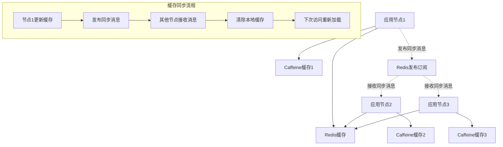
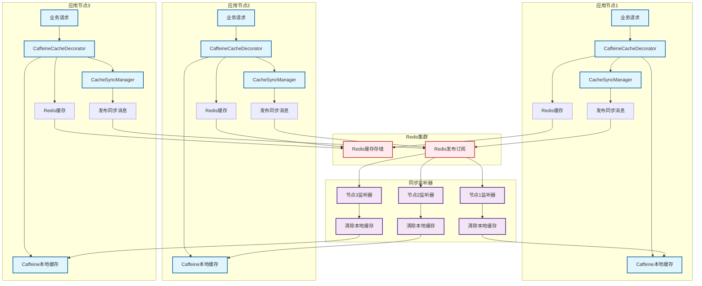
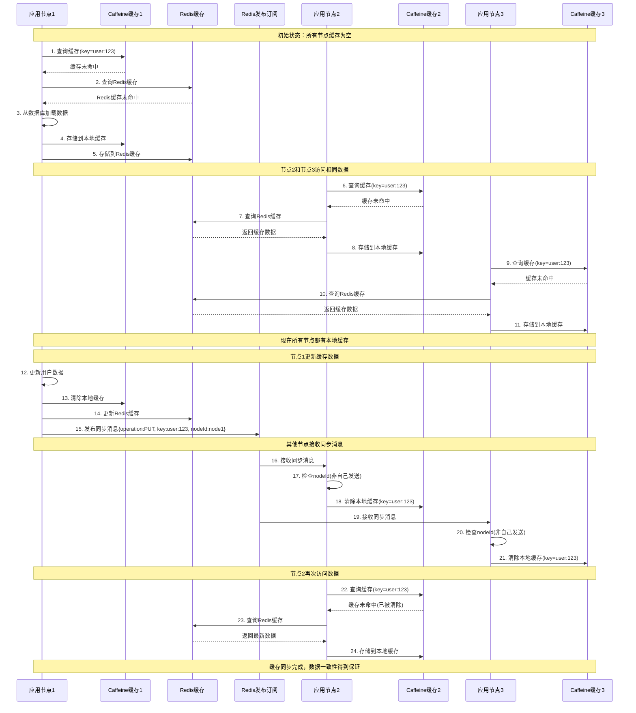
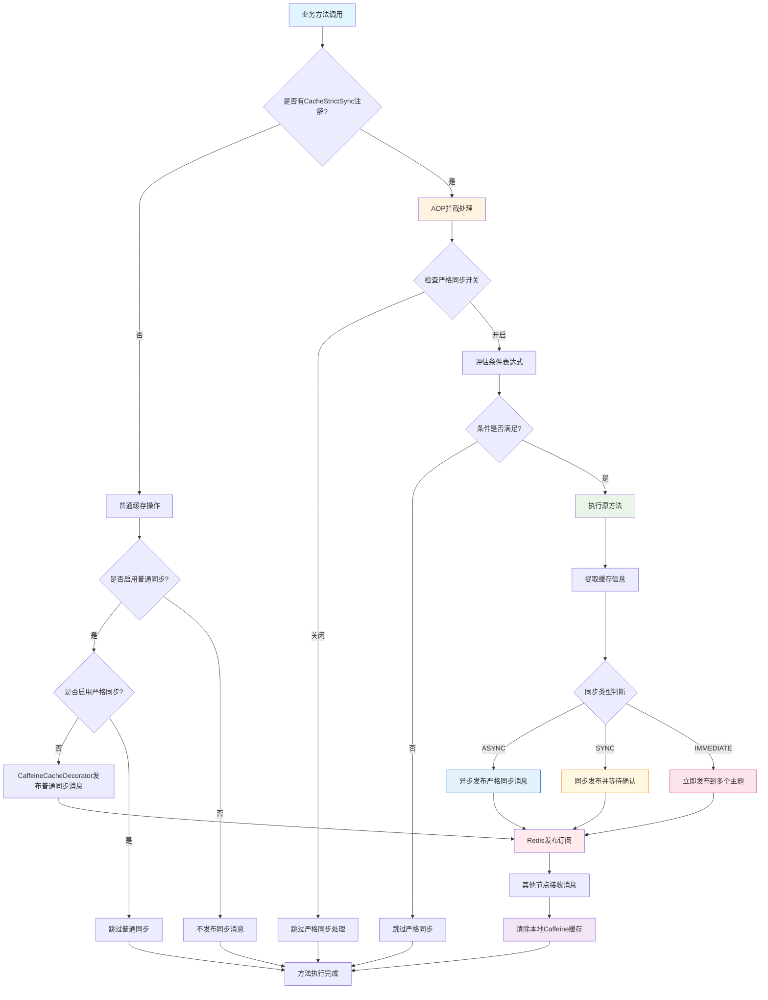

# 分布式缓存同步功能测试指南

## 功能概述

本功能解决了 RuoYi-Vue-Plus 项目中 Caffeine + Redis 多级缓存在分布式环境下的数据一致性问题。提供了两种同步模式：

1. **普通同步模式**：通过 Redis 发布订阅机制，实现缓存变更的实时同步
2. **严格同步模式**：通过 `@CacheStrictSync` 注解，提供更强的一致性保证和灵活的同步策略

## 解决的问题

1. **缓存一致性问题**：某台机器更新本地 Caffeine 缓存后，其他机器的本地缓存没有同步更新
2. **写缓存不一致**：在分布式部署情况下，缓存更新操作只影响当前节点，其他节点仍然使用旧数据

## 实现原理

### 架构图



+ **写缓存一致性解决方案结构图**




+ **缓存同步时序图**




### 核心组件

1. **CacheSyncMessage**: 缓存同步消息模型
2. **CacheSyncManager**: 缓存同步管理器
3. **CaffeineCacheDecorator**: 增强的缓存装饰器
4. **CacheSyncTopicListener**: 缓存同步监听器

## 测试步骤

### 1. 环境准备

确保以下配置已启用：

```yaml
# application.yml
cache:
  sync:
    enabled: true  # 启用缓存同步
```

### 2. 单节点功能测试

#### 2.1 基础缓存操作测试

```bash
# 1. 获取缓存数据（首次会从数据库加载）
GET /demo/cache-sync/get?key=test1

# 2. 更新缓存数据
GET /demo/cache-sync/put?key=test1&value=新数据

# 3. 再次获取缓存数据（应该返回更新后的数据）
GET /demo/cache-sync/get?key=test1

# 4. 清除指定缓存
GET /demo/cache-sync/evict?key=test1

# 5. 再次获取缓存数据（应该重新从数据库加载）
GET /demo/cache-sync/get?key=test1
```

#### 2.2 节点信息查看

```bash
# 查看当前节点信息
GET /demo/cache-sync/node-info
```

### 3. 分布式环境测试

#### 3.1 多节点部署

1. 启动多个应用实例（不同端口）
2. 确保所有实例连接同一个 Redis

#### 3.2 缓存同步测试

**节点1操作：**
```bash
# 在节点1上创建缓存
GET http://localhost:8080/demo/cache-sync/get?key=sync_test

# 在节点1上更新缓存
GET http://localhost:8080/demo/cache-sync/put?key=sync_test&value=节点1更新的数据
```

**节点2验证：**
```bash
# 在节点2上获取缓存（应该能获取到节点1更新的数据）
GET http://localhost:8081/demo/cache-sync/get?key=sync_test
```

**节点1清除：**
```bash
# 在节点1上清除缓存
GET http://localhost:8080/demo/cache-sync/evict?key=sync_test
```

**节点2验证：**
```bash
# 在节点2上再次获取缓存（应该重新从数据库加载）
GET http://localhost:8081/demo/cache-sync/get?key=sync_test
```

### 4. 严格同步测试

#### 4.1 基础严格同步测试

```bash
# 1. 检查严格同步状态
GET /demo/cache-strict-sync/status

# 2. 测试异步严格同步
GET /demo/cache-strict-sync/user/1

# 3. 测试立即同步更新
PUT /demo/cache-strict-sync/user
Content-Type: application/json
{
  "id": 1,
  "name": "更新的用户",
  "email": "updated@example.com"
}

# 4. 测试同步等待删除
DELETE /demo/cache-strict-sync/user/1

# 5. 测试条件同步（ID > 100）
GET /demo/cache-strict-sync/user/conditional/101
GET /demo/cache-strict-sync/user/conditional/50
```

#### 4.2 性能对比测试

```bash
# 性能测试（执行100次缓存操作）
GET /demo/cache-strict-sync/performance-test?iterations=100

# 不同同步类型的响应时间测试
GET /demo/cache-strict-sync/sync-type-test/async
GET /demo/cache-strict-sync/sync-type-test/sync
GET /demo/cache-strict-sync/sync-type-test/immediate
```

#### 4.3 批量操作测试

```bash
# 批量更新测试
POST /demo/cache-strict-sync/users/batch-update
Content-Type: application/json
[1, 2, 3, 4, 5]
```

### 5. 高级测试

#### 5.1 手动同步消息测试

```bash
# 手动发布缓存清除消息
GET /demo/cache-sync/manual-sync?operation=evict&cacheName=test:sync&key=manual_test

# 手动发布缓存更新消息
GET /demo/cache-sync/manual-sync?operation=put&cacheName=test:sync&key=manual_test

# 手动发布缓存清空消息
GET /demo/cache-sync/manual-sync?operation=clear&cacheName=test:sync
```

#### 4.2 Redis缓存检查

```bash
# 检查Redis中的缓存数据
GET /demo/cache-sync/check-redis?key=test1
```

#### 4.3 并发测试

```bash
# 模拟高并发访问
GET /demo/cache-sync/concurrent-test?key=concurrent
```

## 验证要点

### 1. 功能验证

- [ ] 单节点缓存操作正常
- [ ] 多节点缓存同步及时
- [ ] 缓存清除操作同步
- [ ] 缓存更新操作同步
- [ ] 缓存清空操作同步

### 2. 性能验证

- [ ] 同步消息发布不影响主流程性能
- [ ] 本地缓存命中率正常
- [ ] Redis发布订阅延迟可接受

### 3. 异常处理验证

- [ ] Redis连接异常时不影响应用正常运行
- [ ] 同步消息处理异常时有适当日志
- [ ] 节点重启后能正常订阅同步消息

## 监控和日志

### 关键日志

```
# 缓存同步管理器初始化
缓存同步管理器初始化，节点ID: xxx

# 缓存同步监听器启动
缓存同步监听器启动成功，节点ID: xxx

# 发布同步消息
发布缓存清除消息: cacheName=test:sync, key=test1

# 处理同步消息
处理缓存同步消息: operation=EVICT, cacheName=test:sync, key=test1
```

### 性能监控

- 监控缓存命中率
- 监控同步消息处理延迟
- 监控Redis发布订阅性能

## 配置说明

### 基础配置

```yaml
cache:
  sync:
    # 是否启用分布式缓存同步，默认启用
    enabled: true
    # 严格同步配置
    strict:
      # 是否启用严格缓存同步，默认关闭（性能优先）
      enabled: false
      # 严格同步默认超时时间（毫秒）
      timeout: 3000
      # 严格同步重试次数
      retryCount: 3
      # 严格同步批处理大小
      batchSize: 100
```

### 配置模式说明

1. **性能优先模式**（默认）
   ```yaml
   cache:
     sync:
       enabled: true
       strict:
         enabled: false
   ```
   - 使用普通同步，性能最佳
   - 适合大部分业务场景

2. **一致性优先模式**
   ```yaml
   cache:
     sync:
       enabled: true
       strict:
         enabled: true
   ```
   - 只有带 `@CacheStrictSync` 注解的方法才使用严格同步
   - 其他方法不进行同步，性能影响最小

3. **完全关闭同步**
   ```yaml
   cache:
     sync:
       enabled: false
   ```
   - 关闭所有缓存同步功能
   - 适合单机部署或对一致性要求不高的场景

## @CacheStrictSync 注解使用指南

### 基本用法

```java
// 异步严格同步（推荐）
@CacheStrictSync(syncType = CacheStrictSync.SyncType.ASYNC)
@CachePut(cacheNames = "user", key = "#user.id")
public User updateUser(User user) {
    return userService.update(user);
}

// 同步等待模式（确保可靠性）
@CacheStrictSync(
    syncType = CacheStrictSync.SyncType.SYNC,
    timeout = 5000L
)
@CacheEvict(cacheNames = "user", key = "#userId")
public void deleteUser(Long userId) {
    userService.delete(userId);
}

// 立即同步模式（最高优先级）
@CacheStrictSync(syncType = CacheStrictSync.SyncType.IMMEDIATE)
@CacheEvict(cacheNames = "user", allEntries = true)
public void clearAllUsers() {
    userService.clearAll();
}
```

### 高级用法

```java
// 条件同步
@CacheStrictSync(
    syncType = CacheStrictSync.SyncType.ASYNC,
    condition = "#user.id > 100",  // 只对ID大于100的用户启用严格同步
    priority = 1
)
@CachePut(cacheNames = "user", key = "#user.id")
public User updateImportantUser(User user) {
    return userService.update(user);
}

// 指定缓存名称
@CacheStrictSync(
    syncType = CacheStrictSync.SyncType.ASYNC
    cacheNames = {"user", "userProfile"},  // 明确指定要同步的缓存
)
@Cacheable(cacheNames = "user", key = "#userId")
public User getUser(Long userId) {
    return userService.findById(userId);
}
```

### 同步类型说明

| 同步类型 | 描述 | 性能影响 | 适用场景 |
|---------|------|---------|---------|
| ASYNC | 异步同步，发布消息后立即返回 | 最小 | 大部分业务场景 |
| SYNC | 同步等待，等待确认后返回 | 中等 | 需要确保同步成功的场景 |
| IMMEDIATE | 立即同步，最高优先级 | 较大 | 关键数据的实时同步 |

### 最佳实践

1. **优先使用 ASYNC 模式**：在大部分场景下提供足够的一致性保证
2. **谨慎使用 SYNC 模式**：只在必须确保同步成功的关键操作中使用
3. **合理设置条件**：使用 `condition` 属性避免不必要的同步操作
4. **设置合适的优先级**：重要操作使用更高的优先级

## 注意事项

1. **避免循环依赖**：CacheSyncManager 使用延迟获取方式避免与 Spring Cache 的循环依赖
2. **消息去重**：通过节点ID避免处理自己发送的同步消息
3. **异常处理**：同步功能异常不影响主业务流程
4. **性能考虑**：同步操作异步执行，不阻塞主流程
5. **注解优先级**：启用严格同步时，`@CacheStrictSync` 注解的方法由AOP处理，普通同步不再生效

## 故障排查

### 常见问题

1. **同步不生效**
   - 检查 `cache.sync.enabled` 配置
   - 检查 Redis 连接状态
   - 检查应用日志中的错误信息

2. **性能问题**
   - 检查 Redis 发布订阅性能
   - 检查缓存命中率
   - 调整 Caffeine 缓存配置

3. **内存泄漏**
   - 检查 Caffeine 缓存大小配置
   - 监控应用内存使用情况


# 二 缓存同步配置选择指南

## 配置方案对比

| 配置方案 | 普通同步 | 严格同步 | 性能影响 | 一致性保证 | 适用场景 |
|---------|---------|---------|---------|-----------|---------|
| **性能优先** | ✅ 启用 | ❌ 关闭 | 最小 | 基础 | 大部分业务场景 |
| **一致性优先** | ✅ 启用 | ✅ 启用 | 中等 | 强 | 关键业务数据 |
| **精确控制** | ❌ 关闭 | ✅ 启用 | 最小 | 按需 | 只对特定方法严格同步 |
| **完全关闭** | ❌ 关闭 | ❌ 关闭 | 无 | 无 | 单机部署 |


+ **@CacheStrictSync 注解驱动的缓存同步流程**


## 详细配置说明

### 1. 性能优先模式（推荐）

```yaml
cache:
  sync:
    enabled: true          # 启用普通同步
    strict:
      enabled: false       # 关闭严格同步
```

**特点：**
- 所有缓存操作都会进行普通同步
- 性能影响最小，异步处理
- 提供基础的一致性保证
- 适合 95% 的业务场景

**使用场景：**
- 一般的业务数据缓存
- 对性能要求较高的系统
- 可以容忍短暂数据不一致的场景

### 2. 一致性优先模式

```yaml
cache:
  sync:
    enabled: true          # 启用普通同步
    strict:
      enabled: true        # 启用严格同步
      timeout: 3000
```

**特点：**
- 普通缓存操作使用普通同步
- 带 `@CacheStrictSync` 注解的方法使用严格同步
- 可以灵活控制哪些操作需要严格同步
- 性能和一致性的平衡

**使用场景：**
- 混合业务场景
- 部分数据需要强一致性
- 需要精确控制同步策略

**代码示例：**
```java
// 普通缓存操作，使用普通同步
@Cacheable(cacheNames = "product", key = "#id")
public Product getProduct(Long id) {
    return productService.findById(id);
}

// 关键操作，使用严格同步
@CacheStrictSync(syncType = SyncType.IMMEDIATE)
@CachePut(cacheNames = "user", key = "#user.id")
public User updateUserProfile(User user) {
    return userService.update(user);
}
```

### 3. 精确控制模式

```yaml
cache:
  sync:
    enabled: false         # 关闭普通同步
    strict:
      enabled: true        # 启用严格同步
```

**特点：**
- 只有带 `@CacheStrictSync` 注解的方法才进行同步
- 性能影响最小
- 精确控制同步范围
- 需要手动标记需要同步的方法

**使用场景：**
- 对性能要求极高的系统
- 只有少数关键操作需要同步
- 希望精确控制同步行为

### 4. 完全关闭模式

```yaml
cache:
  sync:
    enabled: false         # 关闭所有同步
```

**特点：**
- 不进行任何缓存同步
- 性能最佳
- 无一致性保证
- 适合单机部署

**使用场景：**
- 单机部署
- 对一致性要求不高
- 性能敏感的应用

## 同步类型选择指南

### ASYNC（异步同步）- 推荐

```java
@CacheStrictSync(syncType = SyncType.ASYNC)
```

**特点：**
- 发布消息后立即返回
- 性能影响最小
- 提供最终一致性

**适用场景：**
- 大部分业务操作
- 对响应时间敏感的接口
- 可以容忍短暂不一致的数据

### SYNC（同步等待）

```java
@CacheStrictSync(
    syncType = SyncType.SYNC,
    timeout = 5000L
)
```

**特点：**
- 等待同步确认后返回
- 有一定性能影响
- 提供强一致性保证

**适用场景：**
- 关键业务操作
- 必须确保同步成功的场景
- 用户权限、配置等敏感数据

### IMMEDIATE（立即同步）

```java
@CacheStrictSync(syncType = SyncType.IMMEDIATE)
```

**特点：**
- 最高优先级同步
- 发布到多个主题
- 性能影响较大

**适用场景：**
- 极其重要的数据更新
- 安全相关的操作
- 系统配置变更

## 性能调优建议

### 1. 合理设置超时时间

```yaml
cache:
  sync:
    strict:
      timeout: 3000        # 根据网络环境调整
```

### 2. 使用条件同步

```java
@CacheStrictSync(
    condition = "#user.isVip == true",  // 只对VIP用户启用严格同步
    syncType = SyncType.ASYNC
)
```

### 3. 设置合适的优先级

```java
@CacheStrictSync(
    priority = 1,           // 数值越小优先级越高
    syncType = SyncType.ASYNC
)
```

### 4. 批处理配置

```yaml
cache:
  sync:
    strict:
      batchSize: 100       # 批处理大小
      maxConcurrentSync: 10 # 最大并发同步数
```

## 监控和诊断

### 关键指标

1. **同步延迟**：消息发布到处理的时间
2. **同步成功率**：成功处理的消息比例
3. **缓存命中率**：本地缓存的命中情况
4. **错误率**：同步过程中的错误比例

### 日志配置

```yaml
logging:
  level:
    org.dromara.common.redis.aspect: DEBUG
    org.dromara.common.redis.manager: DEBUG
```

### 性能测试

```bash
# 测试不同配置下的性能表现
GET /demo/cache-strict-sync/performance-test?iterations=1000

# 对比不同同步类型的响应时间
GET /demo/cache-strict-sync/sync-type-test/async
GET /demo/cache-strict-sync/sync-type-test/sync
GET /demo/cache-strict-sync/sync-type-test/immediate
```

## 迁移建议

### 从无同步到有同步

1. 先启用普通同步模式
2. 观察性能影响和同步效果
3. 根据需要逐步添加严格同步注解

### 从普通同步到严格同步

1. 保持普通同步启用
2. 在关键方法上添加 `@CacheStrictSync` 注解
3. 逐步调整配置和同步策略

### 性能优化迁移

1. 分析当前同步的性能瓶颈
2. 使用条件同步减少不必要的同步操作
3. 调整同步类型和超时配置
