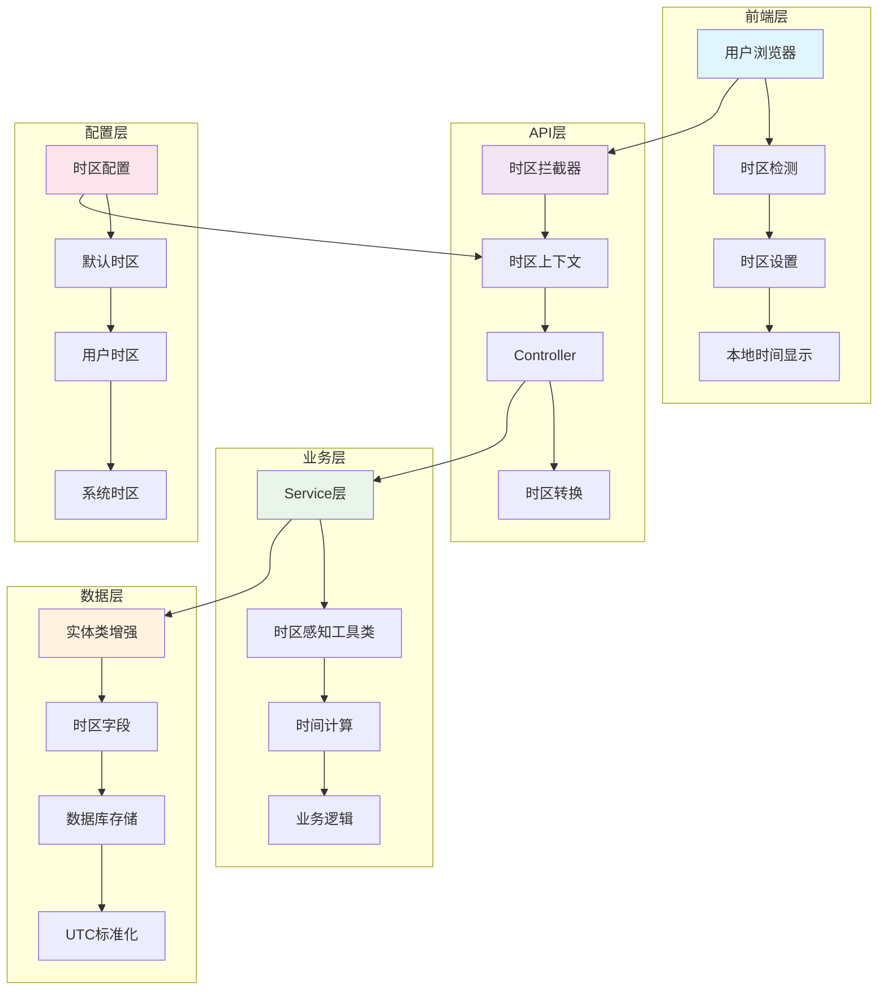
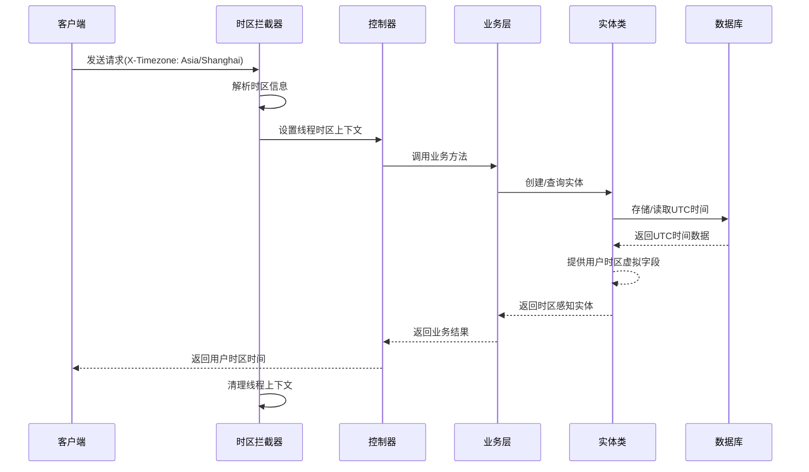

# RuoYi 多时区支持模块

## 概述

`ruoyi-common-timezone` 模块为 RuoYi-Vue-Plus 系统提供完整的多时区支持，解决全球化应用中的时间处理问题。

## 核心特性

- **UTC标准化存储**：数据库统一使用UTC时间存储
- **自动时区检测**：从HTTP请求头自动识别用户时区
- **透明时区转换**：业务代码无需关心时区转换细节
- **向后兼容**：保持现有API接口的兼容性
- **多种时区格式支持**：支持时区ID、偏移量等多种格式

## 快速开始

### 0.架构实现图




### 1. 添加依赖

在需要使用多时区功能的模块中添加依赖：

```xml
<dependency>
    <groupId>org.dromara</groupId>
    <artifactId>ruoyi-common-timezone</artifactId>
</dependency>
```

### 2. 配置文件

在 `application.yml` 中添加时区配置：

```yaml
# 时区配置
timezone:
  # 是否启用时区功能
  enabled: true
  # 默认时区（建议使用UTC）
  default-zone: UTC
  # 拦截器顺序
  order: -100
  # 包含的路径模式
  include-patterns:
    - "/**"
  # 排除的路径模式
  exclude-patterns:
    - "/static/**"
    - "/public/**"
    - "/swagger-ui/**"
  # 是否在响应头中返回服务器时区信息
  include-server-time-zone: true
  # 是否启用时区转换日志
  enable-logging: false
```

### 3. 实体类改造

将现有实体类继承改为时区感知的基类：

```java
// 原来的方式
@Data
@EqualsAndHashCode(callSuper = true)
public class SysUser extends BaseEntity {
    // ...
}

// 改为时区感知的方式
@Data
@EqualsAndHashCode(callSuper = true)
public class SysUser extends TimeZoneAwareEntity {
    // ...
}
```


### 4.调用时序图




## 使用方式

### 1. HTTP请求时区设置

客户端可以通过以下方式设置时区：

```javascript
// 方式1：请求头设置时区ID
fetch('/api/users', {
    headers: {
        'X-Timezone': 'Asia/Shanghai'
    }
});

// 方式2：请求头设置时区偏移量
fetch('/api/users', {
    headers: {
        'X-Timezone-Offset': '+08:00'
    }
});

// 方式3：请求参数设置
fetch('/api/users?timezone=Asia/Shanghai');
```

### 2. 时区工具类使用

```java
// 获取当前UTC时间
Instant utcNow = TimeZoneUtils.nowUtc();

// 获取用户时区当前时间
ZonedDateTime userNow = TimeZoneUtils.nowInUserZone();

// UTC时间转用户时区
ZonedDateTime userTime = TimeZoneUtils.toUserZone(utcInstant);

// 用户时区转UTC时间
Instant utcTime = TimeZoneUtils.toUtc(userZonedTime);

// 格式化为用户时区字符串
String formatted = TimeZoneUtils.formatInUserZone(instant);

// 解析用户时区时间字符串
Instant parsed = TimeZoneUtils.parseFromUserZone("2023-12-25 20:00:00");

// 判断是否为同一天（用户时区）
boolean sameDay = TimeZoneUtils.isSameDayInUserZone(instant1, instant2);
```

### 3. 注解式时区转换

```java
@RestController
@TimeZoneConvert // 类级别注解，对所有方法生效
public class UserController {
    
    @GetMapping("/users")
    @TimeZoneConvert(outputMode = TimeZoneConvert.OutputMode.USER_ZONE)
    public R<List<SysUserVo>> list() {
        // 返回的时间字段会自动转换为用户时区
        return R.ok(userService.selectUserList());
    }
    
    @PostMapping("/users")
    @TimeZoneConvert(inputMode = TimeZoneConvert.InputMode.USER_ZONE)
    public R<Void> add(@RequestBody SysUserBo user) {
        // 输入的时间字段会自动从用户时区转换为UTC
        userService.insertUser(user);
        return R.ok();
    }
}
```

### 4. 实体类时区字段

```java
@Data
@EqualsAndHashCode(callSuper = true)
public class SysUser extends TimeZoneAwareEntity {
    
    private String userName;
    
    // 数据库存储的是UTC时间
    private Date lastLoginTime;
    
    // 获取用户时区的登录时间（JSON序列化时自动转换）
    @JsonFormat(pattern = "yyyy-MM-dd HH:mm:ss")
    @TableField(exist = false)
    public String getLastLoginTimeInUserZone() {
        return TimeZoneUtils.formatDateInUserZone(lastLoginTime);
    }
    
    // 获取登录时间的用户时区ZonedDateTime
    @JsonIgnore
    @TableField(exist = false)
    public ZonedDateTime getLastLoginTimeZoned() {
        return TimeZoneUtils.dateToUserZone(lastLoginTime);
    }
}
```

## 前端集成

### JavaScript时区检测

```javascript
// 自动检测用户时区
const userTimeZone = Intl.DateTimeFormat().resolvedOptions().timeZone;

// 设置全局请求拦截器
axios.interceptors.request.use(config => {
    config.headers['X-Timezone'] = userTimeZone;
    return config;
});

// 或者设置时区偏移量
const offset = new Date().getTimezoneOffset();
const offsetString = (offset <= 0 ? '+' : '-') + 
    String(Math.floor(Math.abs(offset) / 60)).padStart(2, '0') + ':' +
    String(Math.abs(offset) % 60).padStart(2, '0');
    
axios.interceptors.request.use(config => {
    config.headers['X-Timezone-Offset'] = offsetString;
    return config;
});
```

### Vue.js 时区显示

```vue
<template>
  <div>
    <!-- 显示用户时区时间 -->
    <span>{{ formatUserTime(user.createTime) }}</span>
  </div>
</template>

<script>
export default {
  methods: {
    formatUserTime(utcTimeString) {
      if (!utcTimeString) return '';
      
      // 假设后端返回的是UTC时间字符串
      const utcDate = new Date(utcTimeString + 'Z');
      
      // 自动转换为用户本地时间显示
      return utcDate.toLocaleString();
    }
  }
}
</script>
```

## 数据库迁移

### PostgreSQL

```sql
-- 确保数据库时区设置为UTC
SET timezone = 'UTC';

-- 如果需要迁移现有数据，假设现有数据为系统时区
UPDATE sys_user 
SET create_time = create_time AT TIME ZONE 'Asia/Shanghai' AT TIME ZONE 'UTC'
WHERE create_time IS NOT NULL;
```

### MySQL

```sql
-- 设置数据库时区为UTC
SET time_zone = '+00:00';

-- 迁移现有数据（假设现有数据为东八区）
UPDATE sys_user 
SET create_time = CONVERT_TZ(create_time, '+08:00', '+00:00')
WHERE create_time IS NOT NULL;
```

## 最佳实践

1. **数据库统一UTC存储**：所有时间字段在数据库中统一使用UTC时间存储
2. **API层自动转换**：通过拦截器和注解自动处理时区转换
3. **前端本地化显示**：前端根据用户时区显示本地化时间
4. **日志记录时区信息**：在关键操作日志中记录用户时区信息
5. **测试覆盖多时区**：编写测试用例覆盖不同时区场景

## 注意事项

1. **向后兼容性**：现有使用Date类型的代码可以继续使用，但建议逐步迁移
2. **性能考虑**：时区转换会有一定性能开销，在高并发场景下需要注意
3. **夏令时处理**：系统会自动处理夏令时变化
4. **时区数据更新**：定期更新JVM的时区数据库

## 故障排除

### 常见问题

1. **时区解析失败**：检查客户端发送的时区格式是否正确
2. **时间显示错误**：确认数据库中存储的是UTC时间
3. **性能问题**：考虑在缓存层面优化时区转换

### 调试方法

```java
// 启用时区转换日志
logging:
  level:
    org.dromara.common.timezone: DEBUG

// 在代码中获取当前时区信息
String timeZoneInfo = entity.getCurrentTimeZoneInfo();
log.info("当前时区信息: {}", timeZoneInfo);
```
